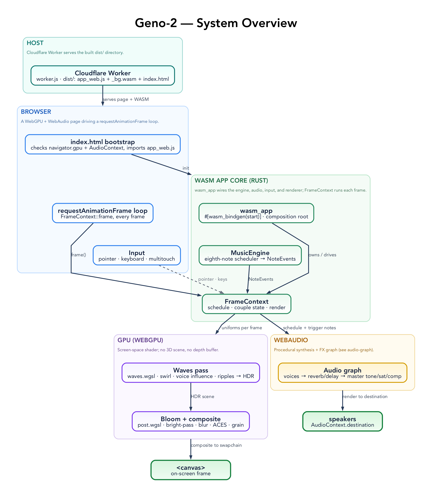
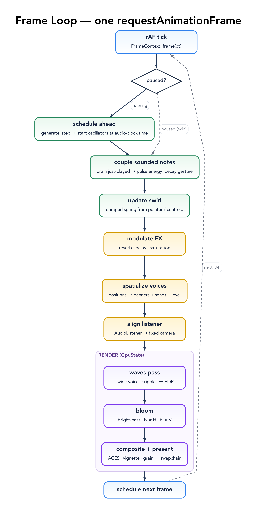
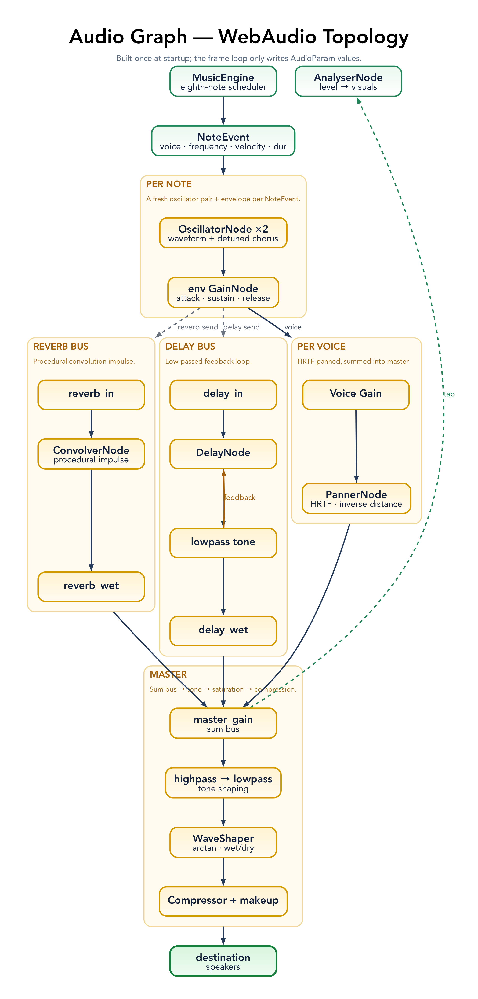

# Geno-2 — Architecture

> Scope: how the code is organized and how one frame of audio + video is produced. Geno-2 is a single Rust crate (`app-web`) compiled to WebAssembly: a generative music engine, a WebAudio FX graph, and a fullscreen WebGPU shader, wired together by one `requestAnimationFrame` loop. The same engine also drives the default **instrument surface**, a separate **control panel**, and an **offline render** (deterministic WAV export), documented in their own sections below.



## Stack

| Layer        | Choice                                  | Notes                                                            |
| ------------ | --------------------------------------- | --------------------------------------------------------------- |
| Language     | Rust (edition 2021)                     | 23 modules + 2 WGSL shaders, one crate (`app-web`)       |
| GPU          | `wgpu` 29 (WebGPU)                      | Fullscreen waves pass + bloom/composite; no WebGL fallback      |
| Shaders      | WGSL                                    | `waves.wgsl` (scene), `post.wgsl` (bright-pass, blur, composite) |
| Audio        | WebAudio via `web-sys`                  | Procedural synthesis + FX graph; no audio samples shipped       |
| Math / POD   | `glam`, `bytemuck`                      | Vector math; `#[repr(C)]` uniforms cast straight into buffers   |
| RNG          | `rand` (`StdRng`) + `getrandom` (`js`)  | Per-voice seeded generators                                     |
| WASM         | `wasm-bindgen` + `web-sys`              | Canvas, pointer/keyboard events, `requestAnimationFrame`        |
| Build        | `wasm-pack` (`--target web`)            | Emits `pkg/app_web.js` + `app_web_bg.wasm`, copied into `dist/` |
| Host         | Cloudflare Workers (`wrangler`)         | `worker.js` serves `dist/`                                      |

The toolchain is plain `stable` (`rust-toolchain.toml`) — no nightly, no threads.

## Repo Layout

```
src/
├── lib.rs            # Crate root: module wiring; re-exports `start` (the only WASM export)
├── wasm_app.rs       # Composition root: build AudioContext + engine + FX + voices + GPU, wire events, start the loop
├── instrument.rs     # Shared default instrument (voices, tempo, scale, seed) used by realtime + offline
├── offline.rs        # Headless deterministic render to a 32-bit WAV under an OfflineAudioContext
├── control.rs        # Exported setters (bpm/detune/root/scale/seed/paused/volume/start) for the separate control panel
├── perf.rs           # Optional gesture bridge retained for relay tooling
├── frame.rs          # FrameContext + per-frame update (schedule → swirl → FX → spatialize → render); the rAF driver
├── audio.rs          # WebAudio graph: master FX buses (tone, saturation, compressor, reverb, delay), per-voice strips, note trigger
├── input.rs          # Input state (mouse, drag, multitouch) + pointer→pixel/uv helpers + multitouch geometry
├── overlay.rs        # Start overlay + hint overlay (BPM · detune · scale)
├── dom.rs            # DOM helpers: window/document, click listeners, DPR-aware canvas sizing
├── constants.rs      # Tuning constants: swirl spring, FX mapping, per-voice sends, camera Z, bloom
├── render.rs         # GpuState: WebGPU init + the per-frame render (waves → bloom → composite)
├── render/
│   ├── targets.rs    # Offscreen HDR scene target + two half-res bloom buffers
│   ├── waves.rs      # Waves fullscreen pass: pipeline, bind group, WavesUniforms (3 voices, swirl, ripple)
│   ├── post.rs       # Post pipelines (bright-pass, blur, composite), uniforms, blit helper, bind groups
│   └── helpers.rs    # Texture-creation helpers
├── core/
│   ├── mod.rs        # Re-exports `music`; embeds WAVES_WGSL / POST_WGSL via include_str!
│   └── music.rs      # MusicEngine: the generative scheduler; scales/modes/tunings; midi_to_hz(+detune)
└── events/
    ├── mod.rs        # Event-wiring re-exports
    ├── keyboard.rs   # keydown: root/mode/preset/tempo/detune/volume/mute/fullscreen
    ├── keymap.rs     # key→root MIDI and digit→mode/tuning tables (host-testable)
    └── pointer.rs    # Pointer + multitouch gestures: flare / carve / carve-drop + continuous multi-finger surface
shaders/
├── waves.wgsl        # Fullscreen scene: swirl displacement, per-voice influence, touch marks, ripple propagation
└── post.wgsl         # Bright-pass, separable blur, ACES tonemap composite, vignette, grain
index.html            # Default instrument surface + help/pairing overlays + WebGPU/Audio error UI
control.html          # Separate panel (/control): pairing code, tempo, detune, root, scale, seed, master, pause
offline.html          # Headless harness that drives the offline WAV render
worker.js             # Cloudflare asset worker (versioned-asset cache)
scripts/gen-env.js    # Stamps pkg/env.js with the build's git short SHA
scripts/relay.mjs     # Optional Node dev relay for legacy relay tooling
scripts/render-offline.mjs  # Drives the offline WAV render in headless Chrome
web-test.js           # Puppeteer smoke test (boot, WebGPU, keyboard, FPS)
```

`core`, `input`, and `events::keymap` compile on the host (not `#[cfg(target_arch = "wasm32")]`), so the generative engine, multitouch geometry, and key tables are unit-tested with plain `cargo test`. Everything that touches `web-sys` is gated to the wasm target.

## Patterns

Most files are an instance of one of a handful of recurring idioms; naming them once makes the rest predictable.

**Host-testable core, browser-gated shell.** The musically and geometrically interesting code (`core::music`, `input`'s `MultiTouchState` geometry, `events::keymap`) is pure Rust with no `web-sys`, so it runs under `cargo test` with no browser. `MusicEngine` never imports a web type — it emits `NoteEvent`s that the wasm layer renders to WebAudio.

**Single composition root + self-scheduling loop.** `wasm_app::init` (one `#[wasm_bindgen(start)]` export, via `lib.rs`) builds every subsystem — AudioContext, `MusicEngine`, the FX graph, voice routing, `GpuState`, and the event handlers — then hands a `FrameContext` to `frame::start_loop`, which arms a `requestAnimationFrame` callback that re-arms itself each frame. Shared mutable state is `Rc<RefCell<…>>` (the single-threaded-WASM idiom; no `static mut`).

**Deferred input: accumulate, then drain.** DOM pointer/keyboard handlers write into shared `MouseState` / `DragState` / `MultiTouchState`. The frame loop reads that state once per frame, decaying gesture energy/flash/spin exponentially and sending active touch points to the shader as visible performance marks. Edge events (taps, carve ripples, touch-surface ripples) are pushed onto a one-slot `queued_ripple_uv` and drained by the renderer, decoupling bursty event delivery from the synchronous frame.

**Procedural everything (no assets).** The reverb impulse response is generated at runtime (seeded xorshift noise × an exponential decay envelope), the saturation curve is an arctan lookup table, and each voice's timbre is an oscillator plus a slightly detuned chorus oscillator. Nothing but code and shaders ships.

**POD uniforms mirrored Rust ↔ WGSL, guarded at compile time.** `WavesUniforms`, `VoicePacked`, and `PostUniforms` are `#[repr(C)]` + `bytemuck::Pod`, byte-compatible with their WGSL `struct` counterparts, so they `bytes_of` straight into uniform buffers with no serialization. The Rust and WGSL definitions are one contract and change together — a `const _: () = assert!(size_of::<…>() == N)` next to each struct fails the build if a field is added or reordered without updating the matching shader.

**Typed domain values.** Tempo, detune, MIDI pitch, and frequency are newtypes (`Bpm`, `Cents`, `MidiNote`, `Frequency` in `core/music.rs`), not bare `f32`s. `Bpm` and `Cents` validate at construction (`Bpm::new` clamps to `[1, 400]` and sanitizes non-finite; `Cents::new` clamps to ±200), so an out-of-range tempo or detune is unrepresentable and the engine setters carry no runtime guard. `MidiNote::to_freq` is the single typed path from a pitch to the `Frequency` that flows through `NoteEvent` into the audio layer, so a MIDI number can't be passed where Hz is expected.

**Fullscreen-triangle passes.** The waves pass and every post step are a single oversized triangle (`draw(0..3, 0..1)`, no vertex buffer) — the standard cheaper-than-a-quad fullscreen idiom.

**Compile-time-embedded shaders.** WGSL is pulled in with `include_str!` (`core::WAVES_WGSL` / `POST_WGSL`), so the shaders are compiled into the WASM — no runtime fetch, no separate asset to deploy.

**Deliberate `'static` at the browser boundary.** Objects the browser holds past setup are given a `'static` lifetime three ways, by intent: event-listener closures are `.forget()`-ed (dropping one would silently unregister the listener); the `requestAnimationFrame` callback is held in an `Rc<RefCell<Option<Closure>>>` that the loop re-references each frame, so it stays alive without leaking a fresh closure per frame; and the canvas handed to the WebGPU surface is `Box::leak`-ed once (`frame::init_gpu`) to satisfy the surface's `'static` bound. Each is a conscious one-time leak at the JS↔WASM seam, not an accident.

**Display-synced canvas sizing.** A `resize` listener keeps the canvas backing buffer at its displayed size × `devicePixelRatio` (capped at 2×, `dom::sync_canvas_backing_size`); `GpuState::resize_if_needed` reconfigures the surface and rebuilds the offscreen targets to match.

**Labeled GPU resources.** Every buffer, pipeline, bind group, pass, and texture carries a `label: Some(...)` (the `render/` modules and `render.rs`), so each is identifiable in browser GPU debuggers and validation messages.

**FX graph built once, parameters written per frame.** `audio::build_fx_buses` and `wire_voices` construct the entire WebAudio node graph a single time at startup; the frame loop never adds or removes nodes, it only writes `AudioParam` values (wet levels, sends, panner positions, saturation drive). Per-note oscillators are the one exception — created and stopped per `NoteEvent` in `trigger_one_shot`.

**Lookahead audio scheduling (two clocks).** The frame loop runs on `requestAnimationFrame` time but schedules notes against the independent `AudioContext` clock: each grid step is generated up to ~120 ms early (`MusicEngine::generate_step`) and its oscillator started at an exact future time (`audio::trigger_one_shot`), so frame jitter never smears note onsets. A small pending-visual queue replays each note's pulse when it actually sounds, so picture and sound stay locked despite the lead.

**Errors bubble as `anyhow::Result`; `JsValue` only at the boundary.** The engine and setup code (`audio`, `render`, `wasm_app::init`) return `anyhow::Result`, attaching context as failures propagate; `JsValue` is confined to the `#[wasm_bindgen]` `start` surface and the DOM error overlay. A failed node-graph build surfaces its real cause in the console rather than a bare unit error.

**Named tuning constants.** Smoothing time-constants, the swirl spring, FX-mapping weights, and per-voice send curves live as named constants in `constants.rs`; the audio FX design and per-note synthesis are named at the top of `audio.rs`; and the generative weights and thresholds are named in `core/music.rs`. Tuning lives in legible blocks rather than scattered literals (the per-waveform synthesis profiles and per-voice generative profiles stay inline as match arms — see *Patterns to adopt*).

**Off-screen control surface.** `/control` is a separate same-origin page, not an overlay inside the performance canvas. It shows a random pairing code and sends `{t:"set",k,v,code}` messages over `BroadcastChannel` with a `localStorage` fallback; `index.html` ignores panel messages until the matching code is entered in the help panel, then applies them through `src/control.rs` and reflects state back to the panel. Settings can change while the default instrument route stays visually clean for capture.

## Patterns to Adopt

Patterns the codebase would benefit from but does not yet apply consistently:

- **Name the remaining profile tuples.** The per-waveform synthesis profiles in `audio.rs` (glide, attack, sustain, release per waveform) and the per-voice generative profiles in `core/music.rs` (velocity/duration/register policy per voice) are still inline tuples. They read clearly today as match arms; naming them would mainly help once they need independent tuning.

## How a Frame Is Produced



A single `requestAnimationFrame` callback (`FrameContext::frame`) runs three phases on the shared state:

1. **Schedule ahead** — unless paused, the loop generates every grid step whose time falls within a ~120 ms lookahead window and starts each note's oscillator at its exact `AudioContext`-clock time (`MusicEngine::generate_step` → `audio::trigger_one_shot`), so onsets are sample-accurate rather than quantized to frame boundaries (the "two clocks" pattern). Each scheduled note also drops a pending visual onset stamped with the same time.
2. **Couple state to audio + visuals** —
   - drain the notes whose time has now arrived and bump their voices' pulse energy, so the picture pulses *with* what's audible rather than ~120 ms early;
   - smooth the per-voice pulse energies; decay gesture energy/flash/spin;
   - update the inertial **swirl** from the pointer or multitouch centroid — a damped spring in UV space;
   - modulate the **global FX** (reverb wet, delay wet/feedback, saturation drive/mix) from swirl energy, gesture flash, and pointer position;
   - push each voice's engine position into its `PannerNode`, and set its delay/reverb sends and level from distance;
   - align the `AudioListener` to the fixed camera.
3. **Render** — feed the ambient clear color, active touch points, any queued ripple, and the smoothed swirl strength into `GpuState`, then `render()` (waves → bloom → composite).

Loud note onsets also queue a visual ripple, so the picture pulses with the music. State lives in the engine and the GPU between frames; the loop is a tail chain of rAF calls, not a timer.

## Audio Engine



`audio.rs` builds the WebAudio graph once (`build_fx_buses`, `wire_voices`) and fires notes through it (`trigger_one_shot`).

**Per note.** A `NoteEvent` becomes an `OscillatorNode` (the voice's waveform) plus a slightly detuned **chorus** oscillator, both through one envelope `GainNode` (attack → sustain → exponential release, shaped per waveform with a short pitch glide). The envelope feeds three places: the voice gain, the delay send, and the reverb send.

**Per voice.** `voice gain → PannerNode (HRTF, inverse-distance) → master`. Each voice also has a delay send and a reverb send. Per frame, the voice's engine-space position drives the panner and scales its sends and level by distance, so the carve gesture's moving voices sweep through space.

**Master chain.** Everything sums into `master_gain`, then: a high-pass + low-pass tone shaping, an arctan **WaveShaper** saturation (wet/dry blended), a **DynamicsCompressor** with makeup gain, and out to `destination`. The reverb bus is a procedurally-generated convolution IR; the delay bus is a `DelayNode` with a low-passed feedback loop. Swirl/gesture energy modulates the wet levels and saturation drive each frame (see the frame loop), so motion audibly opens up the space.

> An `AnalyserNode` taps the master bus, so the frame loop's ambient energy responds to the overall output level alongside the per-note pulses.

## Generative Music Engine

`core/music.rs` is the headless heart. `MusicEngine` holds three voices (default: saw bass, triangle mid, sine high), each with its own seeded `StdRng`, and advances an eighth-note grid in `tick`. Per step, for each voice:

- a **Euclidean gate** (per-voice polymeter, e.g. 5-in-13, 7-in-11, 4-in-17) blended with a swing term and a position-driven travel term sets the trigger probability;
- an **accent gate** and the voice's base probability gate whether a note fires;
- a **motif table** plus rotating **phrase root-shifts** pick the scale degree, with register, contour, octave offset, and a little micro-drift shaping the final MIDI pitch;
- per-voice velocity/duration curves shape the envelope.

Pitch is `midi_to_hz` (A4 = 440) with a global **detune in cents** (±200) applied before conversion. Scales are the seven diatonic modes plus a C-major pentatonic preset and three alt-tuning pentatonics — 19- and 31-TET (n-EDO-derived) and a quarter-tone 24-TET (`8`/`9`/`0`). Reseeding a voice (`R`, gesture release, etc.) swaps its RNG for a fresh sequence. The engine is deterministic given a seed, which is what makes it unit-testable.

## Visual Engine

`render.rs` (`GpuState`) renders entirely in screen space — there is no 3D scene. The "camera" is fixed at `(0, 0, 6)` and exists only to anchor the `AudioListener`.

Resources: one offscreen **HDR** scene target (`Rgba16Float`) plus two half-resolution **bloom** buffers. Each frame:

1. **scene pass** — clear the HDR target to a dark slate that lifts toward a teal/amber haze with ambient energy, then draw the **waves** fullscreen pass (`waves.wgsl`): layered ribbons displaced by the pointer-driven swirl, per-voice influence and pulses, active touch cores/links under the performer's fingers, and propagating click/tap ripples;
2. **bloom** — bright-pass (HDR → bloom A), separable blur (A → B horizontal, B → A vertical);
3. **composite** — `post.wgsl` adds the bloom back, applies an ACES tonemap, vignette, and film grain, and writes the swapchain.

No depth buffer; `Fifo` present (vsync). On resize, the surface and both offscreen targets are rebuilt and the dependent bind groups regenerated.

## Interaction

Pointer and keyboard handlers live in `events/`; the full control list is in the [README § Controls](../README.md#controls). The pointer model (`events/pointer.rs`):

- **Tap (no drag) → flare** — a chord stack of one-shot notes plus a ripple at the cursor.
- **Hold + drag → carve** — continuously rewrites BPM (from travel), detune (from position + rotation), and the voices' lattice positions, periodically reseeding and emitting ripples.
- **Release after a carve → drop** — locks in a new root (from drag angle) and mode (from travel/spin), reseeds all voices, and fires an accent burst.
- **Multitouch** (up to 5 pointers, tracked in `MultiTouchState`): continuous performance surface. Every active finger is packed into the waves uniform and rendered as a touch core/link on screen. The centroid steers swirl, spread smoothly nudges BPM, rotation bends detune, and finger count/spread move voice positions without hidden randomize/pause/reseed commands.

## Offline Render

`src/offline.rs` renders the instrument deterministically to a 32-bit-float stereo WAV — no canvas, audio device, or user gesture. It drives the same `MusicEngine` event stream through the same WebAudio FX graph as the realtime app, but under an `OfflineAudioContext` rendered far faster than realtime (`scripts/render-offline.mjs` runs it in headless Chrome via `offline.html`). The graph is generic over `BaseAudioContext` so one definition serves both contexts, and `trigger_one_shot` takes an explicit `now` (realtime passes the audio clock; offline passes each note's onset). `src/instrument.rs` factors the default instrument — voices, tempo, scale, seed — so realtime and offline share one definition. The offline render applies the FX graph's *baseline* parameters only — none of the realtime loop's swirl/gesture modulation, since there is no interaction — which is part of what keeps it deterministic. A given seed always renders the same piece (runs differ only by sub-perceptual convolution FP noise), ready for mastering.

## Control Panel

The instrument can be driven from a separate local panel without rendering controls over the performance output:

- **Instrument.** `/` opens the clean touch surface by default and shows only a tap-to-start audio unlock layer over the canvas. The help panel remains available with `H`, including the bottom-right code entry for linking a panel. If no panel is linked, keyboard, pointer, and touch controls remain local.
- **Panel.** `control.html` (`/control`) generates a six-digit code and sends tempo, detune, root, scale, seed, master volume, and pause messages over a same-origin `BroadcastChannel`, with `localStorage` as a fallback for browser contexts that need it.
- **Setters.** `src/control.rs` exposes `bpm`, `detune`, `root`, `scale`, `seed`, `paused`, `volume`, and `start` over handles stashed by `wasm_app`, backed by `MusicEngine::reseed_all` and `core::scale_for_name`.
- **Pairing + state reflection.** The instrument only accepts panel messages whose `code` matches the entered pairing code. It posts `control_get_state()` back to `/control` with that same code, so the linked panel follows keyboard/touch changes without needing any visible canvas UI.

## Build & Deploy

- `npm run build` → `wasm-pack build --target web --release`, then `scripts/gen-env.js` stamps `pkg/env.js` with the git short SHA, and the JS + wasm + `index.html` + `favicon.svg` are copied into `dist/`.
- Cloudflare Assets serves the app directly; `run_worker_first` is limited to `/room/*`, and that legacy relay path returns 404 unless `RELAY_ENABLED=true`. Static `_headers` sets browser hardening headers, keeps HTML and `env.js` revalidated, and marks the JS glue/wasm immutable. `index.html` still versions both the JS and wasm URLs with `?v=<git-sha>`, so a deploy is picked up immediately while the heavy assets cache efficiently.
- `npm run dev` builds and serves locally; `npm run deploy` builds and ships it. CI (`.github/workflows/ci.yml`) runs the full gate on every push/PR and deploys to Cloudflare on `main` when the Cloudflare secrets are present.

## What This Architecture Deliberately Does Not Include

- **No WebGL fallback.** The renderer targets WebGPU; `index.html` checks for it and shows a message rather than degrading.
- **No AudioWorklet.** The rAF loop schedules notes ahead on the `AudioContext` clock (the two-clock lookahead — see *How a Frame Is Produced*), so onset timing is sample-accurate without a dedicated audio thread. An AudioWorklet would only be needed for custom per-sample DSP, which the graph does not do.
- **No 3D scene / object picking.** Audio is spatialized through per-voice panners, but the voices are not interactive on-screen objects — the visuals are a screen-space shader.
- **No server in the audio/video path.** The instrument renders and sounds entirely client-side. The default control panel is same-origin browser messaging, not a server relay.
- **No threads.** The WASM is single-threaded — no `SharedArrayBuffer`, so no cross-origin-isolation headers are needed.
